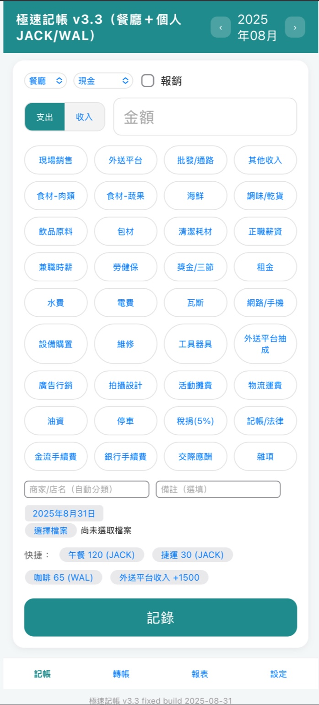
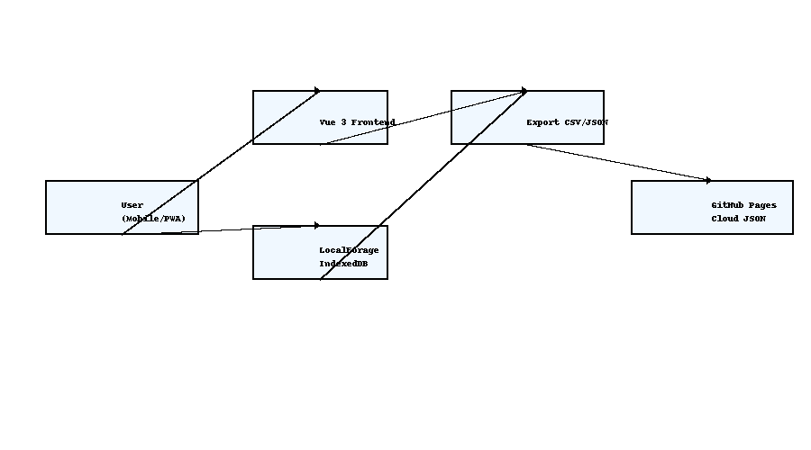
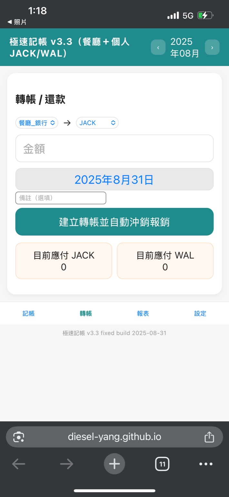
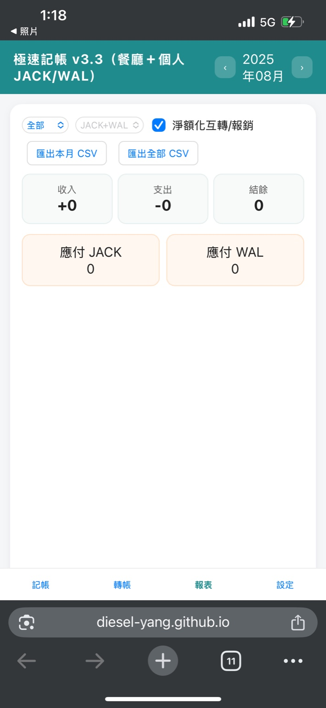
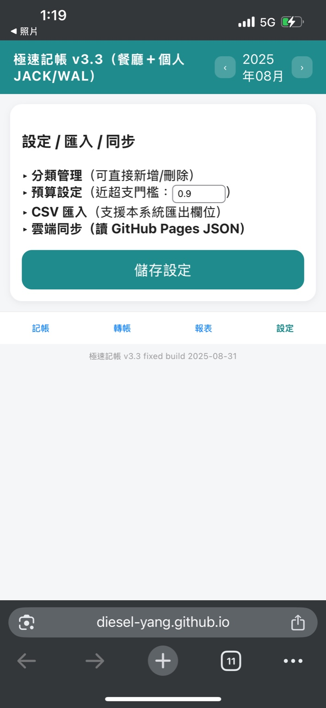

# 極速記帳 PWA v3.3（餐廳＋個人 JACK/WAL）

📸 系統預覽  

## 系統架構
- 前端：Vue 3 + LocalForage (IndexedDB 本機資料庫)
- 報表：Chart.js（圓餅 / 折線 / P&L 長條）
- 離線：Service Worker（PWA，可安裝到手機主畫面）
- 部署：GitHub Pages（靜態主機）
- 同步：以 JSON 匯入/匯出，手動上傳到 GitHub Pages

## 功能
1. 餐廳/個人（JACK/WAL）雙帳記帳與快速輸入
2. 轉帳/還款（餐廳 → JACK/WAL）並自動沖銷報銷
3. 餐廳 P&L 報表（收入 / COGS / 人事 / 水電 / 行銷 / 物流 / 行政 / 其他 + COGS% / 人事%）
4. 個人預算與近超支提醒（可自訂門檻）
5. 商家關鍵字自動分類（全聯、家樂福、UberEats、foodpanda…可自訂）
6. 憑證拍照上傳（保存在本機 IndexedDB）
7. 分類可直接在前端新增 / 刪除（餐廳 & 個人）
8. CSV 匯入/匯出（欄位完整）
9. 多裝置同步（JSON 匯入/下載 → 手動上傳 Pages）
10. Footer 顯示版本號與日期（用來辨識是否最新版）

## 📌 快速開始 (Quick Start)
1. 開啟 Pages 網址 `https://<username>.github.io/cashflow/`
2. 首次開啟會建立本機資料庫；建議安裝為 PWA：  
   - iOS Safari：分享 → 加到主畫面  
   - Android Chrome：右上選單 → 安裝應用程式
3. **更新到最新版**  
   - 在網址後加 `?v=13` 強制刷新，例如：`.../cashflow/?v=13`  
   - 或到瀏覽器設定清除站點資料（含 Service Worker 快取）

## 操作手冊（情境式說明）
### 情境 1：記錄餐廳支出
- 買「食材-蔬果」1000 元 → 選 **餐廳 + 現金** → 分類「食材-蔬果」 → 備註可寫「某某市場」 → **記錄**  
- 系統會歸入 COGS，報表即時更新

### 情境 2：個人消費並附收據
- WAL 於 7-11 買咖啡 65 → 選 **個人-WAL + 現金** → 分類「食」 → **上傳憑證** → **記錄**  
- 報表清單可點「憑證」開啟圖片

### 情境 3：餐廳員工墊付報銷
- JACK 先墊清潔耗材 500 → 選 **餐廳 + JACK先墊** → 勾 **報銷** → **記錄**  
- 報表會顯示「應付 JACK +500」

### 情境 4：餐廳轉帳給 JACK 報銷
- 餐廳現金還 JACK 500 → **轉帳** → from「餐廳_現金」→ to「JACK」→ 金額 500 → **建立**  
- 系統自動沖銷 JACK 未結清報銷，餘額同步更新

### 情境 5：設定預算並收到提醒
- 設定 JACK 的「食」預算 5000 → 當月累計達 4500 顯示🟡接近超支；超過 5000 顯示🔴已超支

## 常見問題 (FAQ)
**Q1. 更新後還是舊版？**  
A：PWA 有快取。請在網址加 `?v=13` 或清除站點資料（含 Service Worker）再重開。

**Q2. CSV 與 JSON 差別？**  
A：CSV 給 Excel/報表；JSON 是完整資料備份/多裝置同步用。

**Q3. 匯入資料會不會重複？**  
A：以 `id` 判斷；相同 id 比日期，新者覆蓋舊者；不同 id 才新增。

**Q4. 憑證存哪裡？**  
A：存在本機 IndexedDB，不會自動上傳雲端。

**Q5. 雲端同步能寫回去嗎？**  
A：GitHub Pages 只能讀，不能直接寫。請先在「設定」下載 JSON，再手動上傳到 Pages repo。

## 專業名詞說明
- **P&L (Profit & Loss, 損益表)**：顯示收入、各類成本費用、毛利與營業利益。
- **COGS (Cost of Goods Sold, 銷貨成本/食材成本)**：與餐點直接相關的成本，如食材、包材、清潔耗材。
- **Personnel (人事費用)**：正職薪資、兼職時薪、勞健保、獎金等。
- **Utilities (場地水電)**：租金、水費、電費、瓦斯、網路/手機等。
- **Marketing (行銷/平台費)**：外送平台抽成、廣告行銷、拍攝設計、活動攤費等。
- **Logistics (物流交通)**：物流運費、油資、停車等。
- **Admin (行政/財務)**：會計記帳、法律與稅捐、金流/銀行手續費等。
- **Other (其他)**：交際應酬、雜項、維修、設備購置、工具器具等。

## 系統架構圖

## 部署
1. 將所有檔案放到 GitHub repo 根目錄（含 `.nojekyll`）
2. 在 repo Settings → Pages 啟用 GitHub Pages
3. 透過 `https://<username>.github.io/cashflow/` 開啟；若遇到舊版快取，用 `?v=13` 強制刷新

## 操作截圖

### 記帳頁面

### 轉帳頁面

### 報表頁面

### 設定頁面
